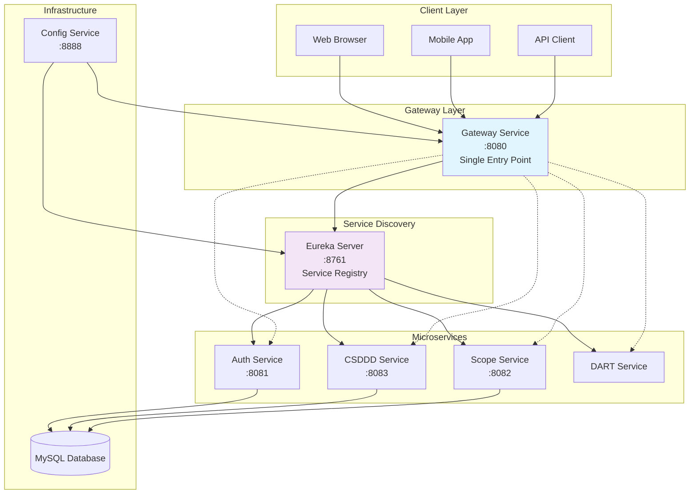
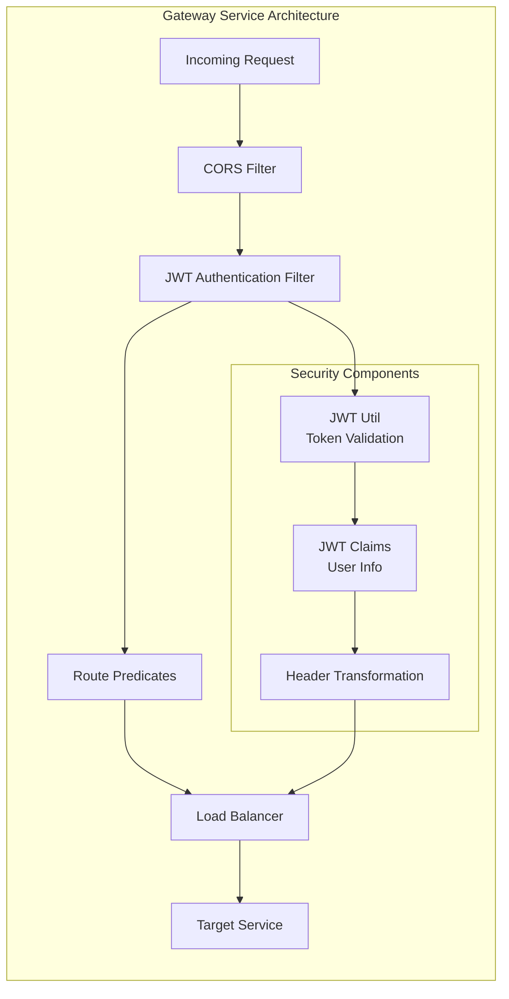
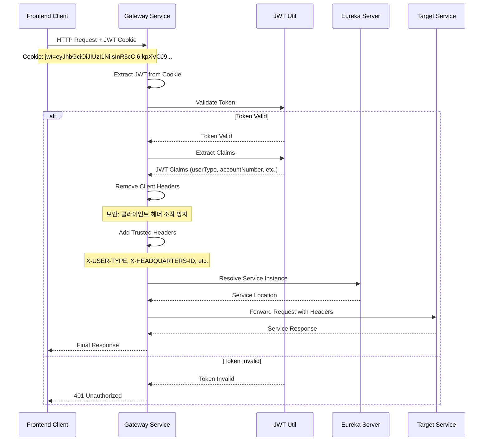
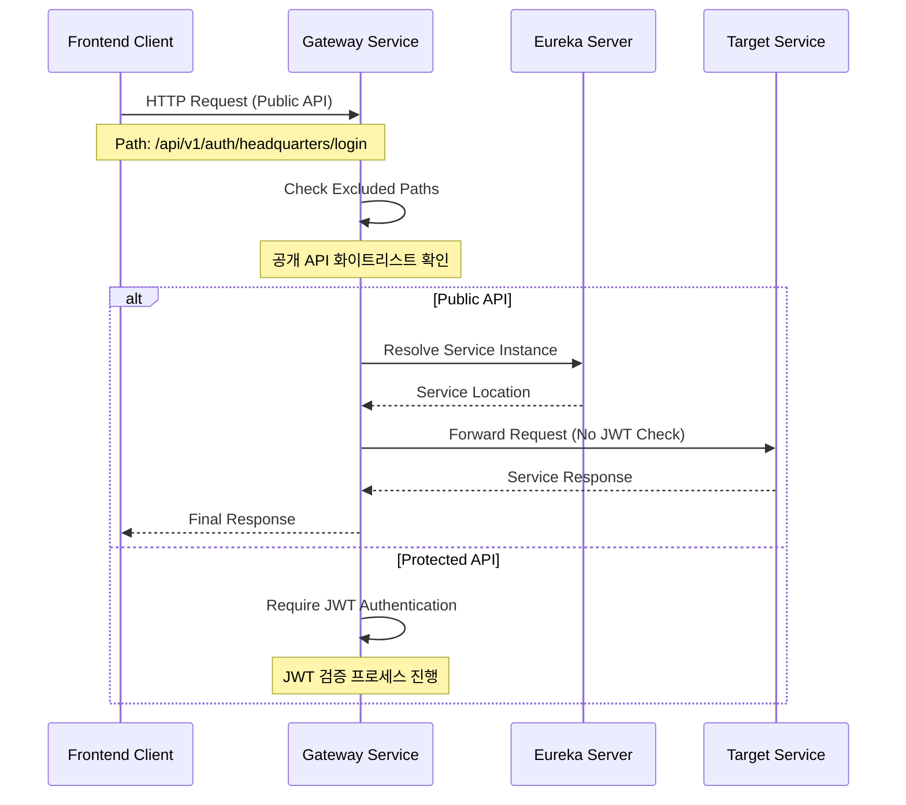
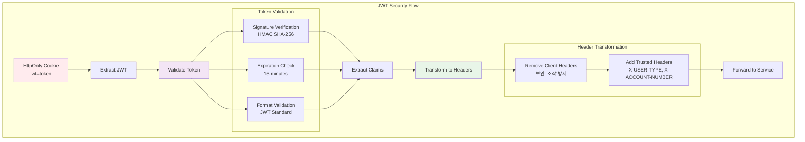

# Gateway Service - Spring Cloud Gateway 기반 API Gateway

**포트폴리오 프로젝트**: ESG 플랫폼 - 마이크로서비스 중앙 라우팅 및 보안 게이트웨이

## 프로젝트 개요

Gateway Service는 ESG 플랫폼의 **단일 진입점(Single Entry Point)**으로 모든 클라이언트 요청의 **중앙집중식 라우팅 및 보안 처리**를 담당하는 마이크로서비스입니다. Spring Cloud Gateway와 WebFlux 기반의 **반응형 아키텍처**로 높은 동시성과 성능을 제공합니다.

### 핵심 기능

- **반응형 API Gateway**: Spring WebFlux 기반 비동기/논블로킹 요청 처리
- **중앙집중식 보안**: JWT 토큰 검증 및 사용자 정보 헤더 변환
- **동적 서비스 라우팅**: Eureka 기반 서비스 디스커버리와 로드 밸런싱
- **보안 헤더 관리**: 클라이언트 헤더 조작 방지 및 신뢰할 수 있는 헤더 주입
- **CORS 정책 관리**: 통합 CORS 설정 및 보안 정책 적용

### 기술 스택

[](https://spring.io/projects/spring-boot)
[](https://spring.io/projects/spring-cloud-gateway)
[-purple.svg)](https://docs.spring.io/spring-framework/docs/current/reference/html/web-reactive.html)
[](https://spring.io/projects/spring-cloud-netflix)
[](https://spring.io/projects/spring-security)

## 시스템 아키텍처

### 마이크로서비스 중심 구조



### Gateway 내부 아키텍처



## JWT 인증 및 라우팅 플로우

### 인증된 요청 처리 시퀀스



### 공개 API 처리 시퀀스



## 보안 설계

### JWT 토큰 처리 아키텍처



### 보안 헤더 매핑

| JWT Claims | 변환된 헤더 | 설명 | 예시 |
|------------|-------------|------|------|
| `accountNumber` | `X-ACCOUNT-NUMBER` | 계정 번호 | 2412161700-L1-001 |
| `userType` | `X-USER-TYPE` | 사용자 타입 | HEADQUARTERS, PARTNER |
| `companyName` | `X-COMPANY-NAME` | 회사명 | 삼성전자 |
| `headquartersId` | `X-HEADQUARTERS-ID` | 본사 ID | 1 |
| `partnerId` | `X-PARTNER-ID` | 협력사 ID | 101 |
| `treePath` | `X-TREE-PATH` | 계층 경로 | /1/L1-001/ |
| `level` | `X-LEVEL` | 협력사 레벨 | 1, 2, 3 |

### 보안 특징

- **클라이언트 헤더 조작 방지**: 모든 사용자 관련 헤더 제거 후 신뢰할 수 있는 헤더로 재설정
- **HttpOnly Cookie**: XSS 공격 방지를 위한 쿠키 기반 JWT 저장
- **토큰 검증**: 서명, 만료시간, 형식의 3단계 검증
- **공개 API 화이트리스트**: 로그인/회원가입 등 JWT 검증 제외 경로 관리

## 라우팅 설정

### 동적 서비스 라우팅

```yaml
spring:
  cloud:
    gateway:
      routes:
        # Auth Service 라우팅
        - id: auth-service
          uri: lb://auth-service
          predicates:
            - Path=/api/v1/auth/**
          filters:
            - name: JwtAuthenticationGatewayFilter
              args:
                excludePaths: "/api/v1/auth/headquarters/login,/api/v1/auth/headquarters/register,/api/v1/auth/partners/login"
        
        # CSDDD Service 라우팅
        - id: csddd-service
          uri: lb://csddd-service
          predicates:
            - Path=/api/v1/csddd/**
          filters:
            - name: JwtAuthenticationGatewayFilter
        
        # Scope Service 라우팅
        - id: scope-service
          uri: lb://scope-service
          predicates:
            - Path=/api/v1/scope/**
          filters:
            - name: JwtAuthenticationGatewayFilter
```

### CORS 설정

```java
@Configuration
public class CorsGlobalConfiguration {
    @Bean
    public CorsWebFilter corsWebFilter() {
        CorsConfiguration config = new CorsConfiguration();
        config.setAllowCredentials(true);
        config.setAllowedOriginPatterns(List.of("http://localhost:3000"));
        config.setAllowedHeaders(List.of("*"));
        config.setAllowedMethods(List.of("GET", "POST", "PUT", "PATCH", "DELETE", "OPTIONS"));
        
        UrlBasedCorsConfigurationSource source = new UrlBasedCorsConfigurationSource();
        source.registerCorsConfiguration("/**", config);
        
        return new CorsWebFilter(source);
    }
}
```

## 성능 및 모니터링

### 반응형 프로그래밍 이점

- **높은 동시성**: 적은 스레드로 수천 개의 동시 연결 처리
- **논블로킹 I/O**: 이벤트 기반 비동기 요청 처리로 높은 처리량
- **백프레셔 지원**: 부하 제어를 통한 시스템 안정성
- **메모리 효율성**: 적은 메모리로 더 많은 요청 처리

### Actuator 모니터링 엔드포인트

| 엔드포인트 | 기능 | 활용 방안 |
|------------|------|----------|
| `/actuator/health` | 헬스 체크 | 로드밸런서 상태 확인 |
| `/actuator/gateway/routes` | 라우팅 정보 | 등록된 라우트 실시간 조회 |
| `/actuator/metrics` | 성능 메트릭 | 처리량, 응답시간 모니터링 |
| `/actuator/gateway/filters` | 필터 정보 | 적용된 필터 체인 확인 |

## API 문서

### 주요 라우팅 엔드포인트

#### 인증 서비스 라우팅

| Original Path | Target Service | 설명 | JWT 검증 |
|---------------|----------------|------|----------|
| `/api/v1/auth/headquarters/login` | auth-service | 본사 로그인 | 제외 |
| `/api/v1/auth/headquarters/register` | auth-service | 본사 회원가입 | 제외 |
| `/api/v1/auth/headquarters/me` | auth-service | 현재 사용자 정보 | 필요 |
| `/api/v1/auth/partners/**` | auth-service | 협력사 관리 API | 일부 제외 |

#### 비즈니스 서비스 라우팅

| Original Path | Target Service | 설명 | JWT 검증 |
|---------------|----------------|------|----------|
| `/api/v1/csddd/**` | csddd-service | CSDDD 자가진단 API | 필요 |
| `/api/v1/scope/**` | scope-service | 탄소배출량 관리 API | 필요 |
| `/api/v1/dart/**` | dart-service | DART API 통합 | 필요 |

## 실행 방법

### 개발 환경 구성

```bash
# 1. 서비스 디스커버리 먼저 실행
cd backend/discovery-service
./gradlew bootRun

# 2. 설정 서버 실행 (선택사항)
cd backend/config-service
./gradlew bootRun

# 3. 인증 서비스 실행
cd backend/auth-service
./gradlew bootRun

# 4. Gateway 서비스 실행 (마지막)
cd backend/gateway-service
./gradlew bootRun
```

### 환경 변수 설정

```yaml
# application.yml
spring:
  application:
    name: gateway-service
  config:
    import: optional:configserver:http://localhost:8888

server:
  port: 8080

# JWT 설정 (Auth Service와 동일해야 함)
jwt:
  secret: ${JWT_SECRET:your-256-bit-secret-key}

# Eureka 설정
eureka:
  client:
    service-url:
      defaultZone: http://localhost:8761/eureka/
```

### 필수 환경 변수

```bash
# JWT 시크릿 (Auth Service와 동일해야 함)
export JWT_SECRET="your-256-bit-secret-key"

# Eureka 서버 주소
export EUREKA_SERVER_URL="http://localhost:8761/eureka"

# CORS 허용 오리진
export CORS_ALLOWED_ORIGINS="http://localhost:3000"
```

## 테스트

```bash
# 단위 테스트 실행
./gradlew test

# 통합 테스트 실행
./gradlew integrationTest

# Gateway 상태 확인
curl http://localhost:8080/actuator/health

# 등록된 라우트 확인
curl http://localhost:8080/actuator/gateway/routes | jq .
```

## 핵심 구현 특징

### 1. 커스텀 JWT 필터 구현

```java
@Component
public class JwtAuthenticationGatewayFilterFactory 
    extends AbstractGatewayFilterFactory<Config> {
    
    @Override
    public GatewayFilter apply(Config config) {
        return (exchange, chain) -> {
            // 1. JWT 쿠키 추출
            String jwt = extractJwtFromCookie(request);
            
            // 2. 토큰 검증
            if (jwtUtil.validateToken(jwt)) {
                // 3. Claims 추출
                JwtClaims claims = jwtUtil.getAllClaimsFromToken(jwt);
                
                // 4. 헤더 변환 (보안 강화)
                ServerHttpRequest modifiedRequest = request.mutate()
                    .headers(headers -> removeClientHeaders(headers))
                    .header("X-USER-TYPE", claims.getUserType())
                    .header("X-ACCOUNT-NUMBER", claims.getAccountNumber())
                    .build();
                
                return chain.filter(exchange.mutate().request(modifiedRequest).build());
            }
            
            return handleUnauthorized(exchange);
        };
    }
}
```

### 2. 반응형 아키텍처 활용

- **WebFlux 기반**: 논블로킹 I/O로 높은 동시성 처리
- **Reactor 패턴**: 이벤트 기반 비동기 요청 처리
- **백프레셔**: 시스템 과부하 방지를 위한 흐름 제어

### 3. 보안 중심 설계

- **헤더 조작 방지**: 클라이언트에서 전송된 모든 인증 헤더 제거 후 Gateway에서 신뢰할 수 있는 헤더 추가
- **공개 API 관리**: 화이트리스트 기반 JWT 검증 제외 경로 관리
- **토큰 보안**: HttpOnly 쿠키 기반 JWT 저장으로 XSS 공격 방지

### 4. 동적 서비스 디스커버리

```java
// Eureka 기반 동적 라우팅
spring:
  cloud:
    gateway:
      routes:
        - id: auth-service
          uri: lb://auth-service  # 로드 밸런싱 지원
```

## 성능 최적화

### 캐싱 전략

- **Eureka 서비스 캐시**: 30초 주기 서비스 목록 갱신
- **Route 캐시**: 메모리 기반 라우팅 규칙 캐싱
- **JWT 검증 최적화**: 동일 토큰 중복 검증 방지

### 메모리 및 스레드 최적화

- **Event Loop**: 적은 수의 스레드로 많은 연결 처리
- **Connection Pool**: HTTP 클라이언트 연결 풀 최적화
- **GC 튜닝**: 반응형 처리에 최적화된 가비지 컬렉션 설정

## 주요 특징

- **확장성**: 수평 확장 가능한 Stateless 아키텍처
- **보안성**: 다층 보안 설계와 중앙집중식 인증
- **성능**: 반응형 프로그래밍으로 높은 처리량
- **모니터링**: Actuator 기반 실시간 상태 추적
- **유연성**: 동적 라우팅과 서비스 디스커버리

---

**기술적 성과**:
- Spring Cloud Gateway 기반 엔터프라이즈급 API Gateway 구현
- 반응형 프로그래밍을 활용한 고성능 비동기 처리 시스템 설계
- JWT 기반 중앙집중식 보안 아키텍처와 헤더 조작 방지 시스템 구현
- Eureka 기반 동적 서비스 디스커버리와 로드 밸런싱 구현

